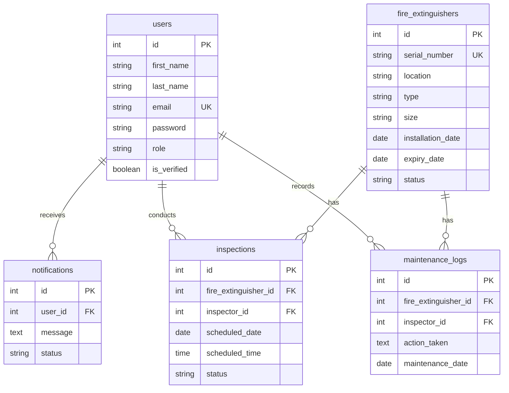

# ERD

```mermaid
erDiagram
  users ||--o{ notifications : receives
  users ||--o{ inspections : conducts
  users ||--o{ maintenance_logs : records
  fire_extinguishers ||--o{ inspections : has
  fire_extinguishers ||--o{ maintenance_logs : has

  users {
    int id PK
    string first_name
    string last_name
    string email UK
    string password
    string role
    boolean is_verified
  }

  fire_extinguishers {
    int id PK
    string serial_number UK
    string location
    string type
    string size
    date installation_date
    date expiry_date
    string status
  }

  inspections {
    int id PK
    int fire_extinguisher_id FK
    int inspector_id FK
    date scheduled_date
    time scheduled_time
    string status
  }

  maintenance_logs {
    int id PK
    int fire_extinguisher_id FK
    int inspector_id FK
    text action_taken
    date maintenance_date
  }

  notifications {
    int id PK
    int user_id FK
    text message
    string status
  }
```
